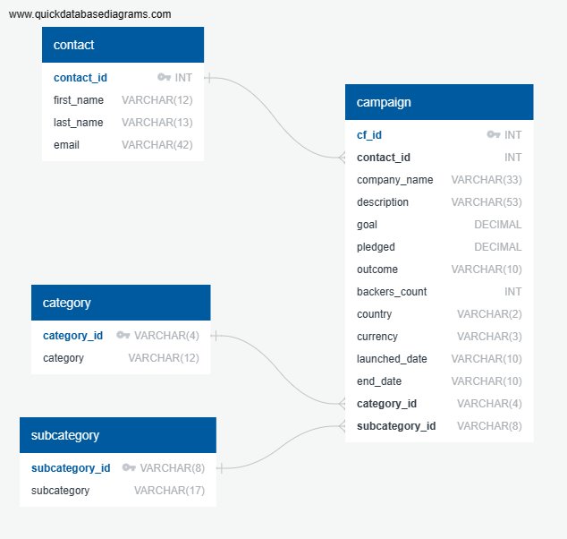

# Crowdfunding_ETL
Repository for Monash University Bootcamp Project 2

Students: Benoit Chamot, Mireille Walton, Nairui (David) Guo

## File structure
- `Resources` directory includes all the .XLSX files used for import and the exported .CSV files
- `Create_DataFrame_Sub_and_Category.ipynb` imports `crowdfunding.xlsx`, and create `category.csv` and `subcategory.csv`
- `Create_DataFrame_Campaign.ipynb` imports `crowdfunding.xlsx`, `category.csv` and `subcategory.csv`, and create `campaign.csv`
- `Create_DataFrame_Contacts.ipynb` imports `contact.xlsx`, and create `contact.csv`
- `DataExploration.ipynb` is a Jupyter notebook used to analyse the CSV file and recommend a structure for the database (tables, columns and types)
- `crowdfunding_db_schema.sql` includes the SQL queries code used to create the database in Postgres and check that the data are imported correctly

## Using the files
1. Run `Create_DataFrame_Sub_and_Category.ipynb` first to make sure `category.csv` and `subcategory.csv` are created
2. Run `Create_DataFrame_Campaign.ipynb`
3. Run `Create_DataFrame_Contacts.ipynb`
4. Create the database using pgAdmin
5. Execute the queries in `crowdfunding_db_schema.sql` and import the CSV files in the database using pgAdmin

## Database
A database is created in Postgres using `crowdfunding_db_schema.sql`. The following ERD is used for the database

The database is populated with the following files in `Resources`:
- Table `campaign` from `campaign.csv`
- Table `category` from `category.csv`
- Table `subcategory` from `subcategory.csv`
- Table `contact` from `contacts.xlsx`
